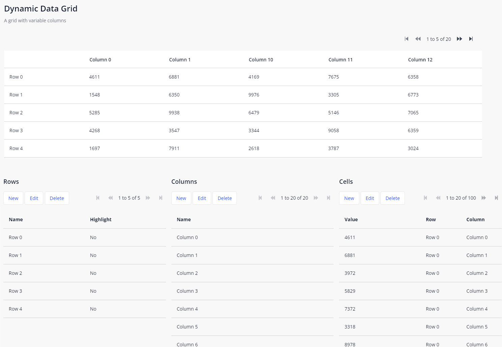

## Dynamic Data Grid
Data Grid with variable columns

**No more nested list views, lightning fast rendering!**

## Features
- Data Gid, with variable columns.
- Render cell content: attribute, text or custom
- Empty row content message
- Empty cell objects can be omitted
- On click action on row / column / cells
- Use the default styling of Mendix Data Widget Grid
- Row and column pagination
- Structure mode preview

## Usage
1. Create a model, with a Row, Column and Cell

2. Place the widget the page

3. Select the cell as data source, Column and Row relation

4. Add some Data

## Notes
Optimize 'Cell Paging' can only be used when each row/column has a cell, and sorting of the cells and rows/column are are equal. Using data source Database or XPath. Does adding and removing data from the grid.
When an empty cell is rendered a warning is written in the console log.

## Demo project
https://testtable-sandbox.mxapps.io/

## Issues, suggestions and feature requests
https://github.com/ClevrSolutions/dynamic-data-grid/issues

