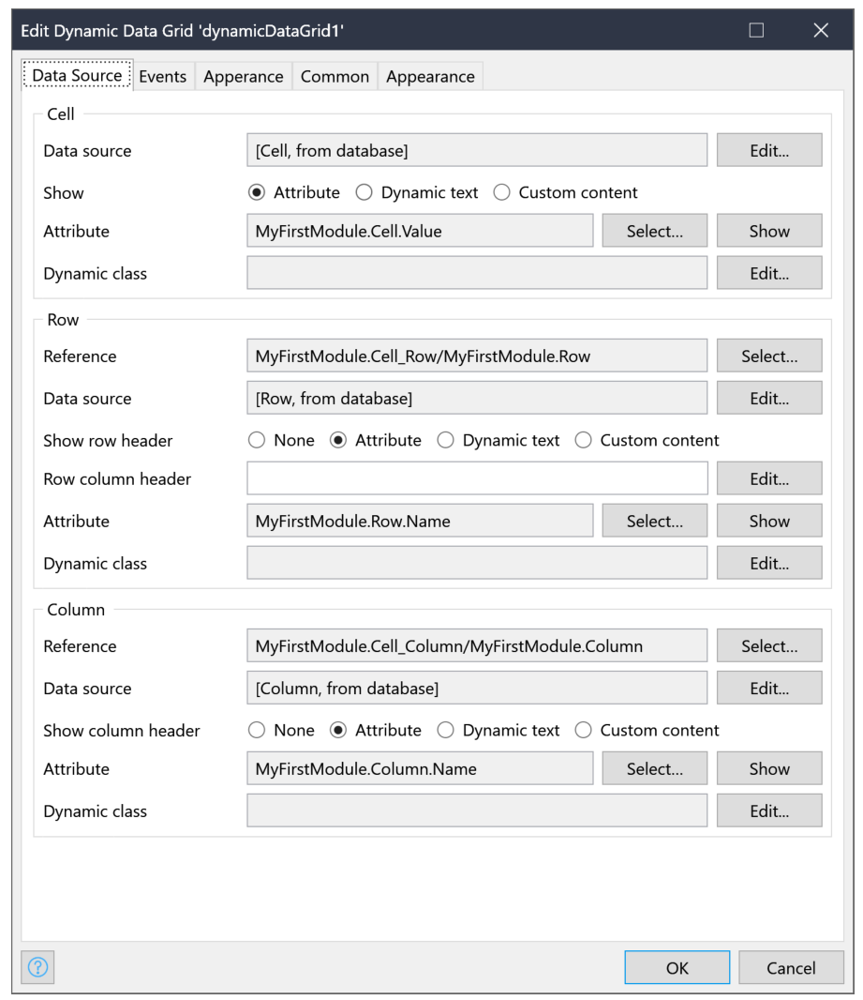

## Table
Table grid with variable columns
!No more need for nest list views!

## Features
- Table grid, with variable columns.
- Render cell content: attribute, text or custom
- Empty row content message
- On row click action
- Use the default styling of Mendix Data Widget Grid

## Usage
1. Create a model, with a Row, Column and Cell

2. Place the widget the page

3. Select the cell as data source, Column and Row relation

## Demo project
https://testtable-sandbox.mxapps.io/

## Issues, suggestions and feature requests
https://github.com/ClevrSolutions/table/issues

