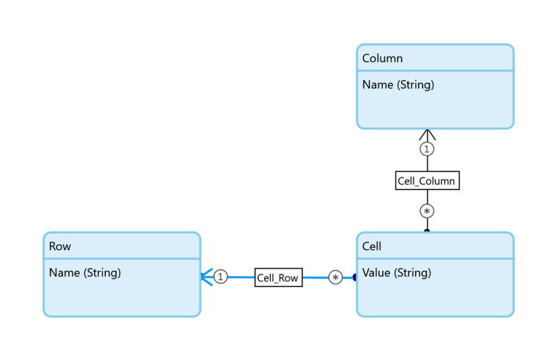

## Dynamic Data Grid

Data Grid with variable columns

**No more nested list views, lightning-fast rendering!**

## Features

-   Data Grid, with a variable number of columns.
-   Render cell content: attribute, text or user custom to build your own cell content, including editable inputs.
-   Empty row content message.
-   Empty cell objects can be omitted when "Optimize cell paging" is disabled.
-   On click action on row, column and or cells
-   Options for pagination for Row, Column or non.

## Aditional benefits.

-   Choose the default styling of the Data Widget Grid 2 widget, or render it as a plain HTML table without any styling.
-   Reuse helper classes for DG2 styling; table-bordered-vertical, table-bordered-horizontal, table-bordered-none, table-compact, table-hover, table-striped
-   Structure mode preview in the Studio Pro. Easy to configure.
-   Accessible for screen readers.
-   Small widget <14Kb.
-   Fast rendering, as data is loaded parallel. 

## Use cases

1. Time writing form; Where the rows represent users, and the column is week. Depending on the project, you might have 1
   to 10 weeks, and you can show the table with one widget.
1. Resource Planning: Where the user can select the period (columns), and the rows are the resource, the cells show the
   sum of the planned week.
1. Pivot tables; sum and group data.
1. Timeslots; postal service shows a timeslot for delivery.
1. Excel-like sheets with columns/rows. You can do this with a list view in a list view,
1. Access Matrix; The row represents a user, the columns are services, a cell can be a checkbox.

Technically, you can build it the cases with a list view in a list view, however:

-   The headers are never appropriately aligned with the cells (Styling).
-   List view clutters rendering with extra HTML elements for search and load more.
-   The rendering is slow, as column data is loaded after row data.
-   List views in list views are not accessible for a screenreader.

## Usage

1. Create a data model with a Row, Column and Cell entity.



2. Place the widget on the page.


3. Select the Cell as the data source, Column and Row relation.


4. Add some Data.


## Style
You have an option for the default styling of the Data Widget Grid 2 widget, or render it as a plain HTML table without any styling.
The helper classes for DG2 styling are available; table-bordered-vertical, table-bordered-horizontal, table-bordered-none, table-compact, table-hover, table-striped
When you want use design properties in your theme. https://docs.mendix.com/apidocs-mxsdk/apidocs/design-properties/#design-properties-definitions

``` json
{
    "com.clevr.widget.web.dynamicdatagrid.DynamicDataGrid": [
        {
            "name": "Borders",
            "type": "Dropdown",
            "description": "Add either a horizontal, vertical separator or both to the cells.",
            "options": [
                {
                    "name": "Both",
                    "class": "table-bordered-all"
                },
                {
                    "name": "Vertical",
                    "class": "table-bordered-vertical"
                },
                {
                    "name": "Horizontal",
                    "class": "table-bordered-horizontal"
                },
                {
                    "name": "None",
                    "class": "table-bordered-none"
                }
            ]
        },
        {
            "name": "Compact",
            "type": "Toggle",
            "description": "Change the cell spacing to compact.",
            "class": "table-compact"
        },
        {
            "name": "Hover",
            "type": "Toggle",
            "description": "Highlight a row when hovering over it. Only useful when the row is clickable.",
            "class": "table-hover"
        },
        {
            "name": "Striped",
            "type": "Toggle",
            "description": "Add alternating background colors to rows.",
            "class": "table-striped"
        }
    ]
}

```


## Notes

The option "Optimize cell paging" can only be used when each row/column has a cell, and the sorting of the cells and
rows/columns are equal, using data source Database or XPath. A warning is written in the console log when an empty cell
is rendered when the optimized cell paging is enabled. "Optimize cell paging" does not work well with adding and
removing data from the grid, which might cause a cell to shift into the wrong column/row.

## Demo project

https://testtable-sandbox.mxapps.io/

Download the demo project:
https://github.com/ClevrSolutions/dynamic-data-grid/releases/download/v1.0.1/DemoProject_DynamicDataGrid.mpk

## Issues, suggestions and feature requests

https://github.com/ClevrSolutions/dynamic-data-grid/issues
