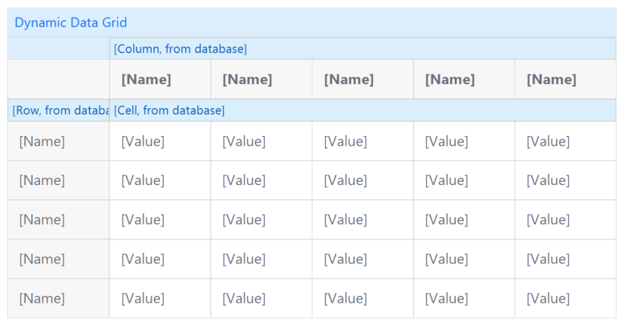

## Dynamic Data Grid

Data Grid with variable columns

**No more nested list views, lightning fast rendering!**

## Features

-   Data Grid, with variable number of columns.
-   Render cell content: attribute, text or user custom to build your onw cell content, including editable inputs.
-   Empty row content message.
-   Empty cell objects can be omitted when "Optimize cell paging" is disabled.
-   On click action on row, column and or cells
-   Choose the default styling of the Data Widget Grid 2 widget, or render it as a plain HTML table without any styling.
-   Options for pagination for Row, Column or non.
-   Structure mode preview in the Studio Pro.

## Usage

1. Create a data model with a Row, Column and Cell entity.

2. Place the widget on the page.

3. Select the Cell as the data source, Column and Row relation.

4. Add some Data.

## Notes

The option "Optimize cell paging" can only be used when each row/column has a cell, and the sorting of the cells and rows/columns
are equal, using data source Database or XPath. A warning is written in the console log when an empty cell is rendered when the optimized cell paging is enabled.
"Optimize cell paging" does not work well with adding and removing data from the grid, which might cause a cell to shift into the wrong column/row.

## Demo project

https://testtable-sandbox.mxapps.io/

## Issues, suggestions and feature requests

https://github.com/ClevrSolutions/dynamic-data-grid/issues
